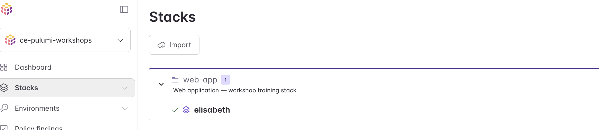
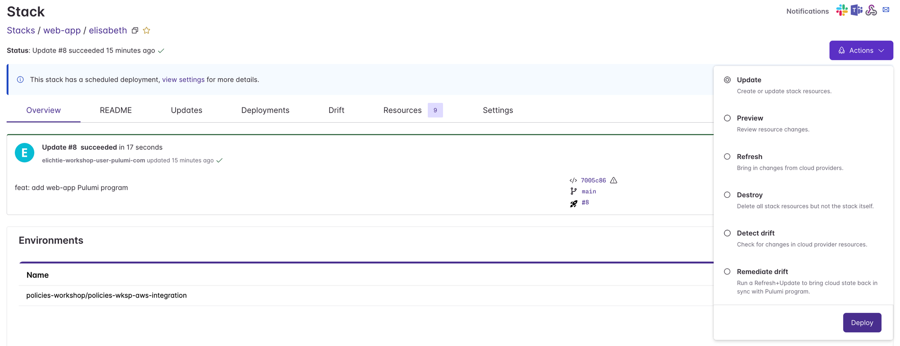
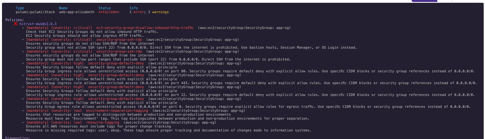

# 02 — Preventative Policy Setup

## Step 3 — Enable Policies in the Preventative Group

The audit group tells *you* about problems. The preventative group is what your developers will feel — violations here show up as warnings or errors during `pulumi preview` and `pulumi up`.

Open your `<yourname>-preventative` policy group and apply the same configuration as the audit group:

- Add `hitrust-aws` (latest version) with **Mandatory** as the default enforcement level
- Configure `Resource-Tagging` with required tags `user` and `wksp`
- Disable `Anti-Malware-Edr`
- Disable `Centralized-Os-App-Logging`

Save the group.

---

## Step 4 — See the Policies in Action

Navigate to **Stacks** and open your `web-app / <yourname>` stack.

Click **Actions** in the top right and select **Update** to trigger a new deployment against the current code.

Click **Deploy**. The deployment will fail with mandatory policy violations from `hitrust-aws@v2.6.3`. You should see errors like these:

The violations on the security group include:

| Rule | Severity | Issue |
|------|----------|-------|
| `ec2-security-group-disallow-inbound-http-traffic` | Critical | HTTP (port 80) open to internet |
| `security-group-ssh-rdp` | Critical | SSH (port 22) open to `0.0.0.0/0` |
| `security-group-default-deny` | High | Ingress on ports 80, 443, 22 and egress allow unrestricted access — no explicit deny |
| `environment-separation-tagging` | Low | Missing `Environment` tag |
| `resource-tagging` | Low | Missing required tags: `user`, `wksp` |

This is the point of the preventative group — your developers now see exactly what needs to be fixed before a deployment can succeed.

---

**Previous:** [01 — Audit Policy Setup](01-audit-policy-setup.md) | **Next:** [03 — Custom Policy Pack](03-custom-policy-pack.md)
