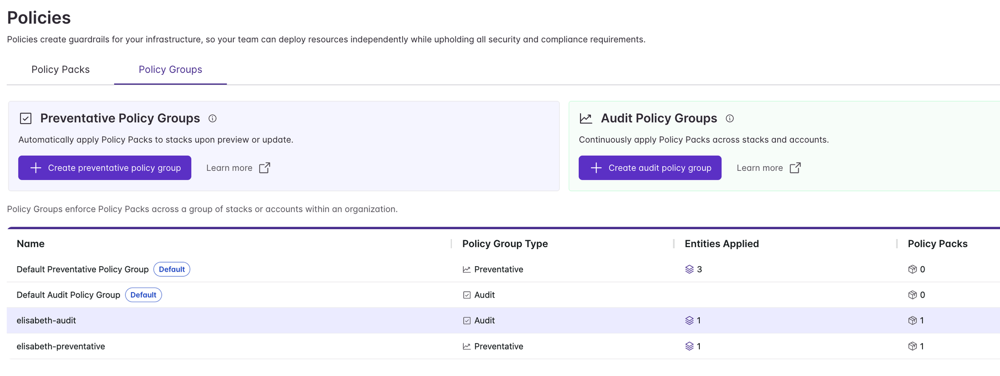
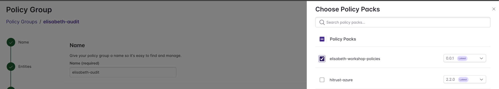
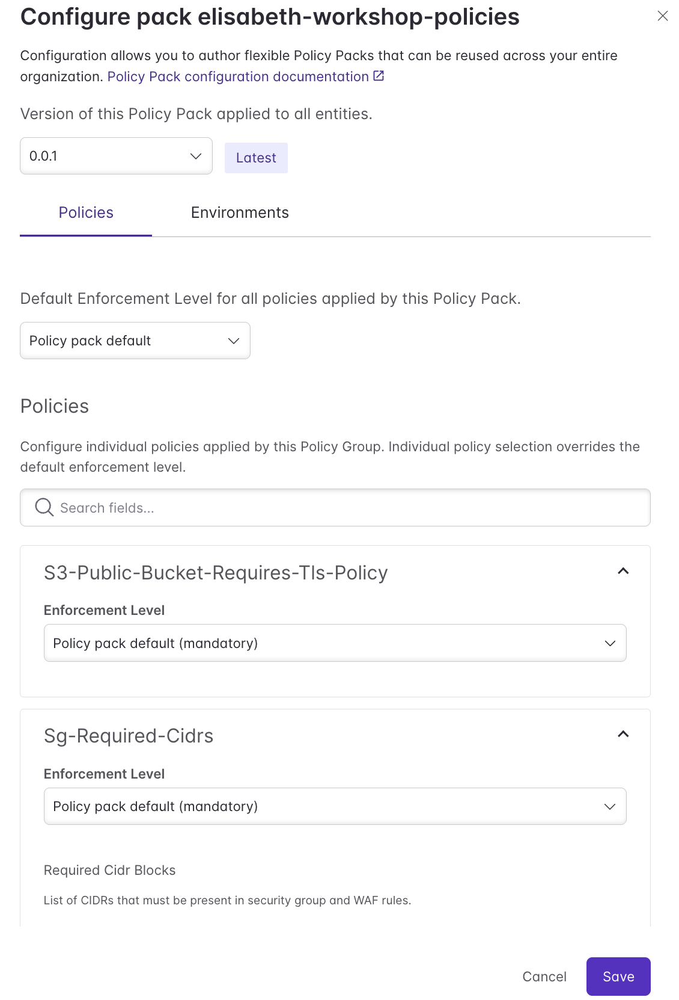
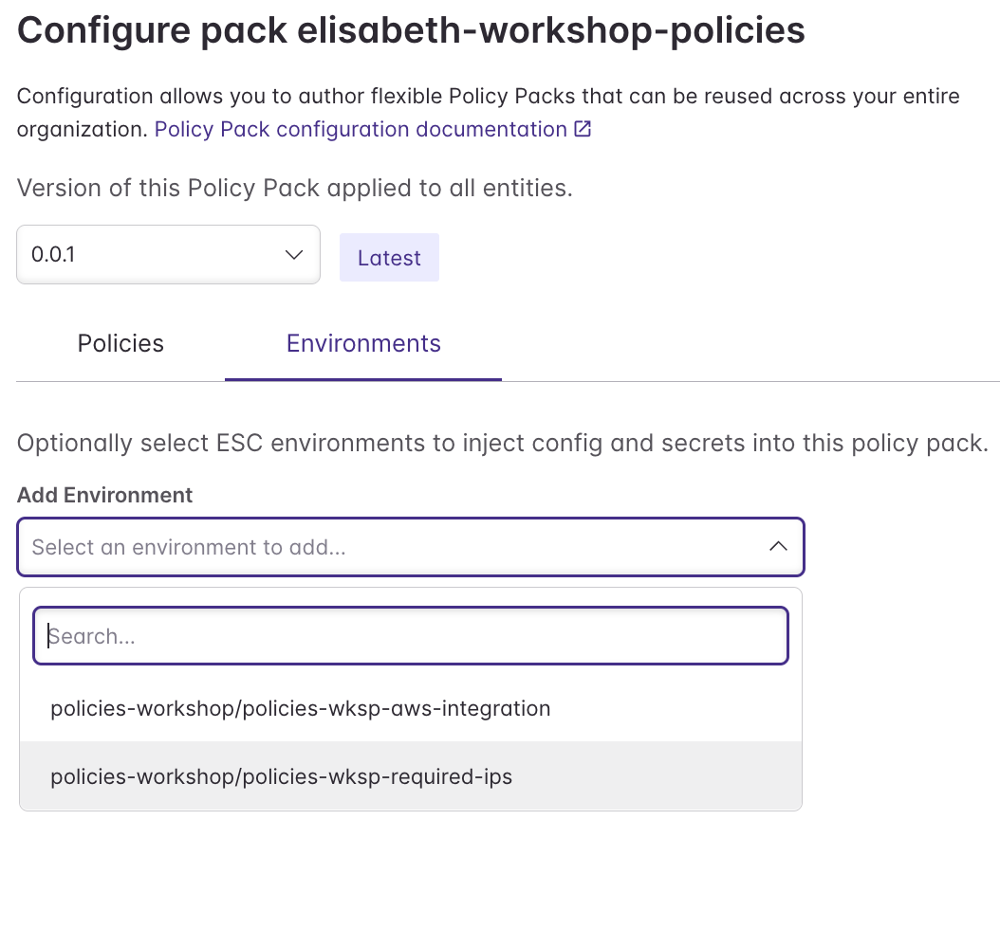
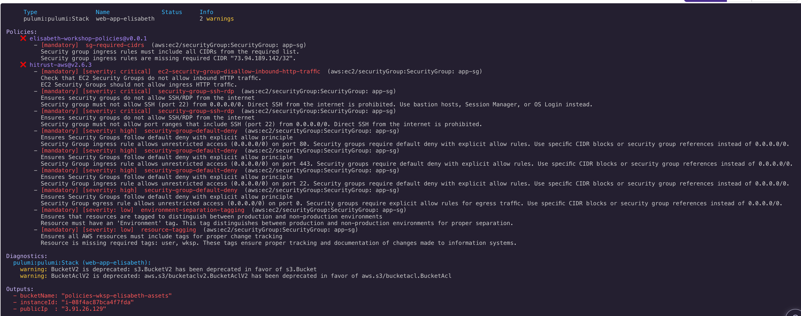

# 04 — Enabling the Custom Policy Pack

## Step 8 — Attach the Pack to Your Policy Groups

Navigate to **Policies → Policy Groups**. You'll see your two groups listed.

Open your `<yourname>-audit` group and add a policy pack. Search for your pack by name and select it.

Click the version dropdown to configure the pack. On the **Policies** tab, leave both policies at the pack default (mandatory).

Click the **Environments** tab and select `policies-workshop/policies-wksp-required-ips`. This injects the `requiredCidrBlocks` list from ESC into your policy pack configuration.

Click **Save**. Repeat for your `<yourname>-preventative` group.

---

## Step 9 — See the Custom Policy Violations

Navigate to your `web-app / <yourname>` stack, click **Actions → Update → Deploy** to trigger a new deployment. You should now see violations from your custom pack alongside the `hitrust-aws` errors — the security group ingress rules will flag as missing the required CIDRs.

---

**Previous:** [03 — Writing a Custom Policy Pack](03-custom-policy-pack.md) | **Next:** [05 — Exporting Findings](05-exporting-findings.md)
