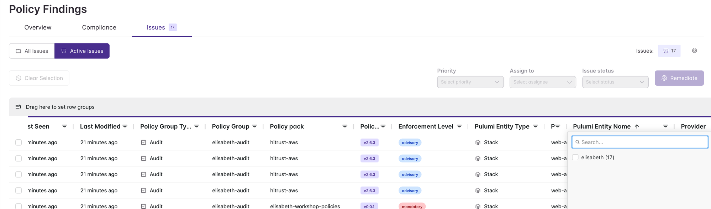
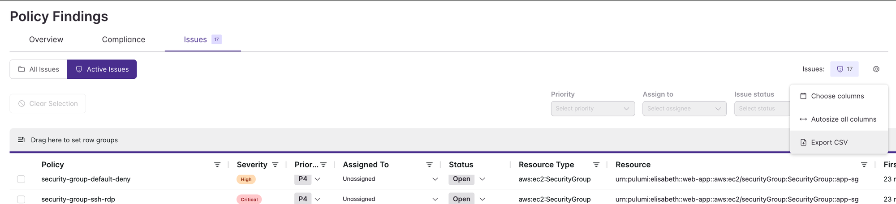

# 05 — Exporting Policy Findings

## Step 10 — Export Your Findings

Navigate to **Policies → Findings → Issues**. This view shows all active policy violations across your stacks.

Click the **Pulumi Entity Name** column filter and select your username to scope the findings to just your resources.

Once filtered, click the settings icon in the top right and select **Export CSV**.

The exported CSV is one of your two deliverables for the workshop.

---

**Previous:** [04 — Enabling the Custom Policy Pack](04-enabling-custom-policy-pack.md)
