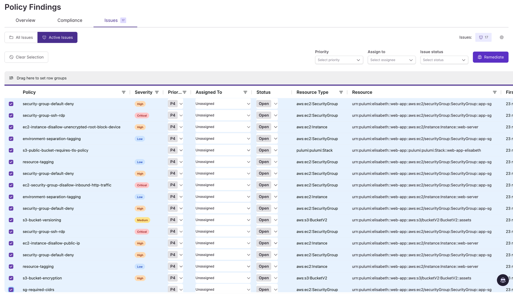
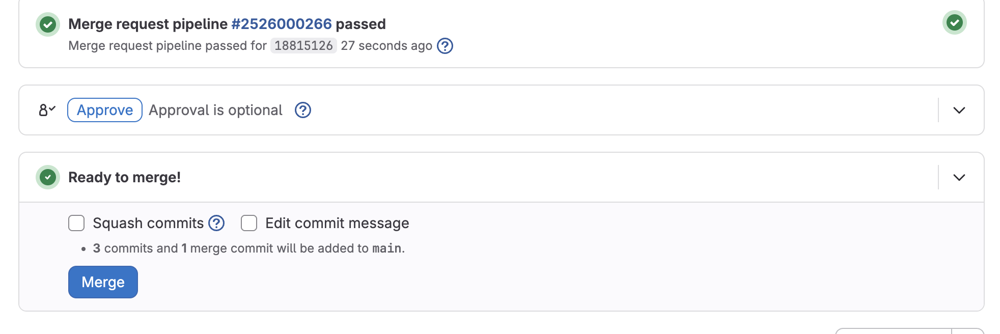
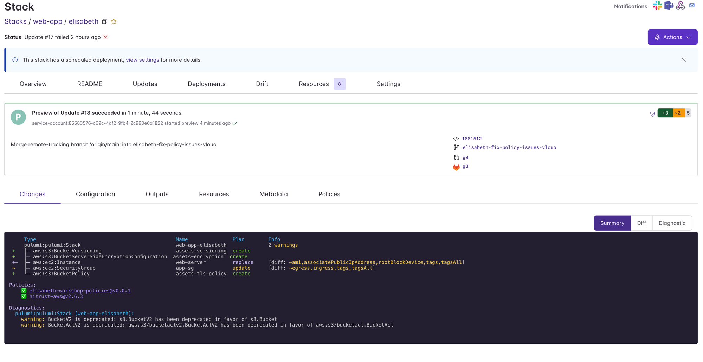
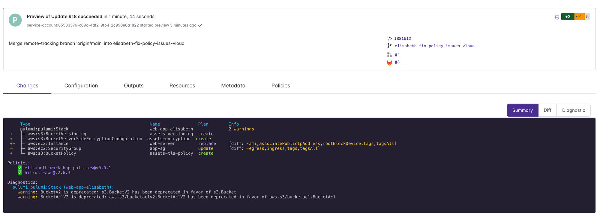

# 06 — Remediation

## Step 11 — Select Your Findings

You can remediate policy violations manually by updating your code, or let Neo do it for you. This walkthrough uses Neo.

Navigate to **Policies → Findings → Issues** and filter by your stack name as before. Select all the findings for your stack — click the first row, then hold **Shift** and click the last row to select everything at once.

Click the **Remediate** button in the top right to kick off a Neo task. Neo will analyze the findings and generate code changes to fix the violations.

Neo will open a pull request on a branch named **`<yourname>-<somestring>`** — for example, `alice-fix-sg-rules`. The CI pipeline is configured to derive your stack name from the branch prefix, so as long as your branch starts with your username followed by a `-`, the preview will run against the correct stack automatically.

---

## Step 12 — Review the PR and Check the Pipeline

Open the merge request Neo created in GitLab. Wait for the CI pipeline to complete — a passing pipeline means `pulumi preview` ran with no policy violations.

Once the pipeline is green, navigate to your `web-app / <yourname>` stack in Pulumi Cloud and open the **Updates** tab. Find the most recent preview run and confirm it succeeded with both policy packs passing.

Click into the preview run to see the full details. Both policy packs should show a green checkmark with no violations.

This passing preview — with both policy packs green — is your second deliverable for the workshop.

> If Neo's changes aren't quite right or don't fully resolve the violations, you can update the code manually. See [`solutions/artifacts/fixedcode.ts`](../../artifacts/fixedcode.ts) for a complete working implementation.

---

**Previous:** [05 — Exporting Findings](05-exporting-findings.md)
