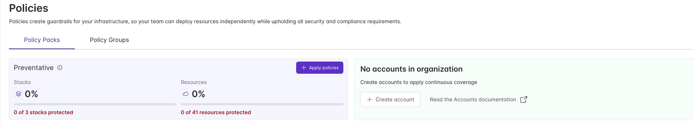
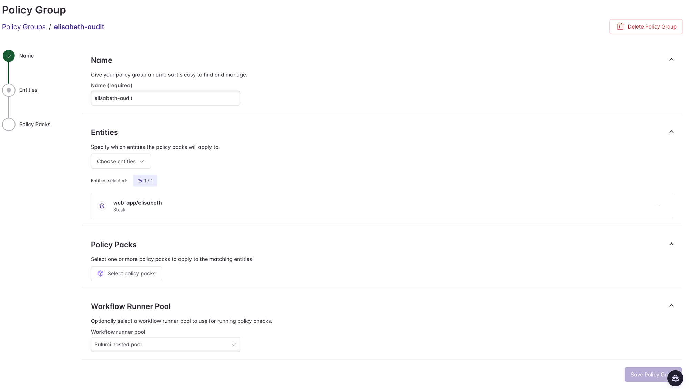
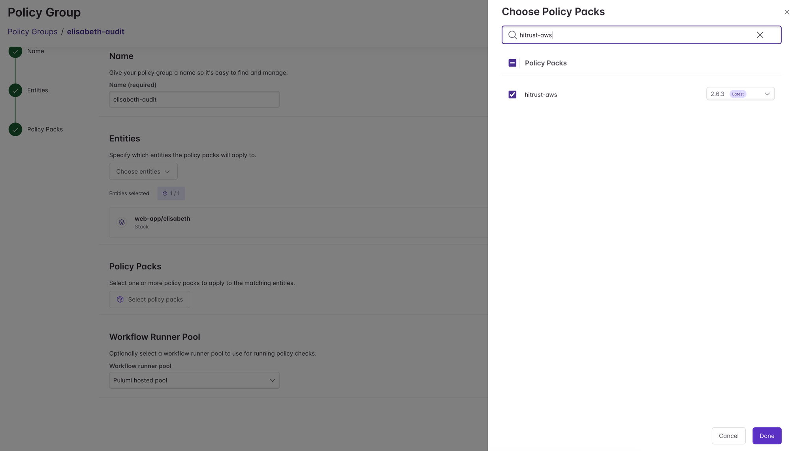
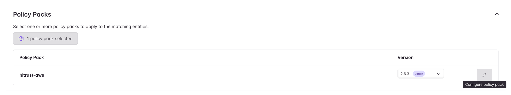
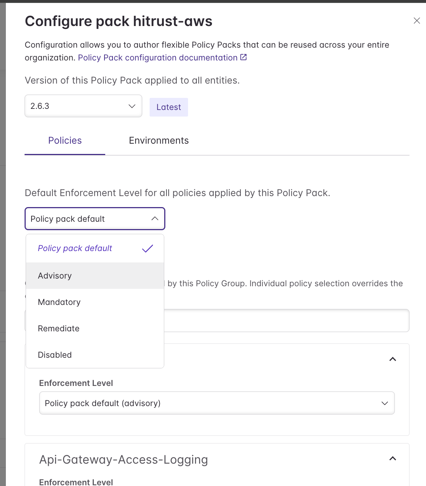
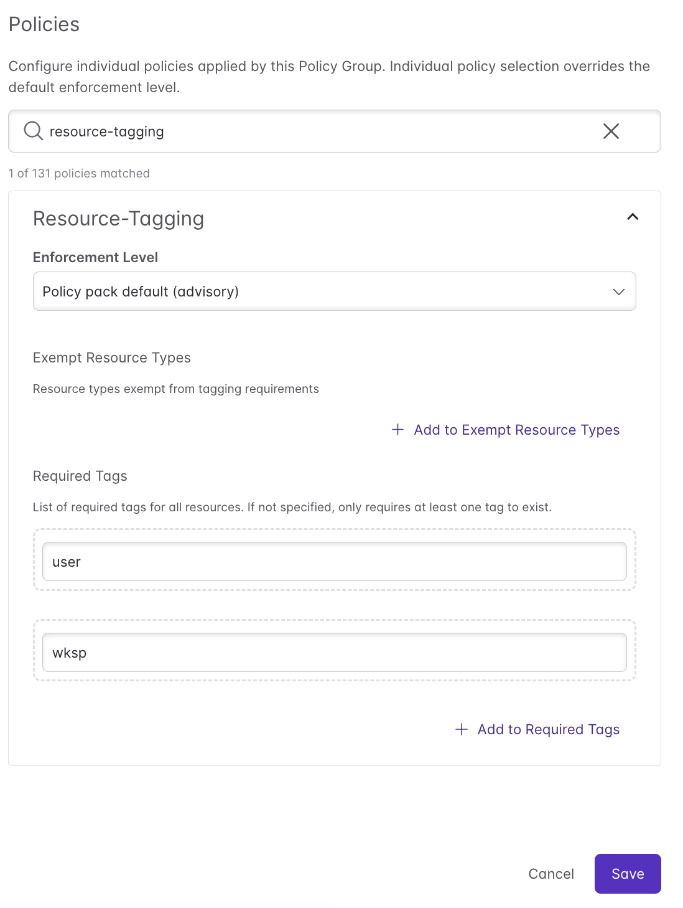
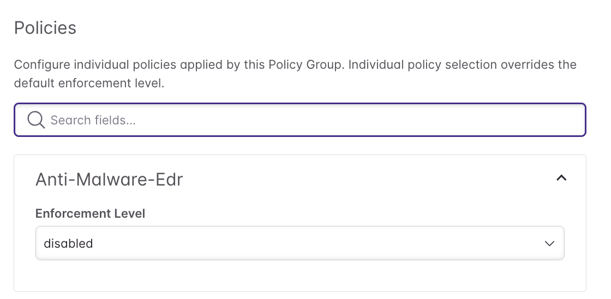
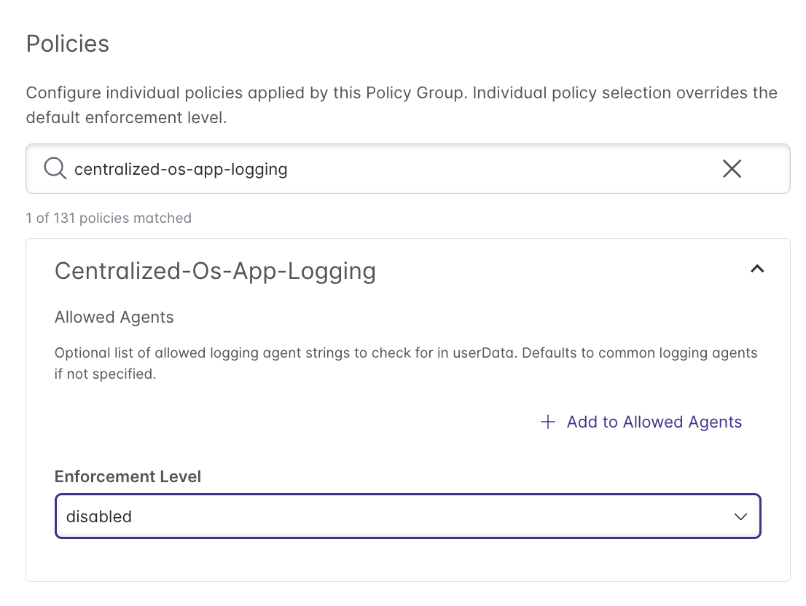

# Policy-as-Code Workshop — Exercise Walkthrough

This walkthrough guides you through the workshop exercises step by step.

---

## Prerequisites

- VSCode installed
- Logged in to your workshop Pulumi account

---

## Step 1 — See the Problem

Navigate to **Management > Policies** in the Pulumi console. Your stacks have no policies applied — nothing is protected.

Your goal by the end of this workshop is to have policies enforced across your stack so that misconfigurations are caught automatically before they reach production.

---

## Step 2 — Enable the Managed Policy Pack

Go to the **Policy Groups** tab and find your `<yourname>-audit` group. Your `web-app` stack is already connected, but no policy packs are applied yet.

Click **Select policy packs**, search for `hitrust-aws`, and check the box. Select the latest version (2.6.3).

Click **Done**. You'll see `hitrust-aws` listed with a pencil icon to configure it.

Click the pencil icon to open the configuration panel. Set the **Default Enforcement Level** to **Advisory** — violations will appear as findings without blocking deployments. Individual rules can override this if needed.

Before saving, search for the **`Resource-Tagging`** rule in the policy list. Under **Required Tags**, add `user` and `wksp` — these are the tags all workshop resources must carry.

Two rules don't apply to this environment because your organization enforces them through a separate toolchain — disable them individually so they don't appear as noise in your findings:

- **`Anti-Malware-Edr`** — set enforcement level to **Disabled**

  

- **`Centralized-Os-App-Logging`** — set enforcement level to **Disabled**

  

Click **Save Policy Group**.

> **Note:** Findings won't appear immediately. It can take a few minutes after saving for the policy engine to scan your stack and surface violations. Grab a coffee and check back shortly.

---

